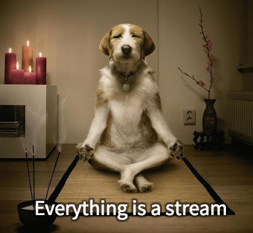

# Funktionell programmering i JavaScript, Part 2️⃣ 🌀

---

---
# Part 2

* Part 1, Grunder i fp
* Part 2, Reactive programing (kul att du är här)
* Part 3, Fortsättning med FP i JS och med React

---

# Part 2, Reactive programing

---


---

# Uppmaning till er!

Säg till när ni:

* inte håller med.

---

# Uppmaning till er!

Säg till när ni:

* inte håller med.
* undrar något.

---

# Uppmaning till er!

Säg till när ni:

* inte håller med.
* undrar något.
* vill förtydliga något.

---

# Uppmaning till er!

Säg till när ni:

* inte håller med.
* undrar något.
* vill förtydliga något.
* vill.

---

# Vad är en Observable?

---

# Låt oss först kolla på en Array

---


# Array är en förutbestämd datamängd i minnet

```js

const myArray = [ '1', '5', '2', 'Oskar', '10' ]

```

---

> Världen är inte förutbestämd

---

> Observable är en datamängd över tid

```js

const myObservable = Observable.fromEvent(myTextField, 'change')

```

---



---

```js

const myArr = Array.of('1', '5', '2', 'Oskar', '10')

const result = myArr.map(Number).filter(isNotNaN)

console.log(result) // [ 1, 5, 2, 10 ]

```

---

```js

const myObs = Observable.of('1', '5', '2', 'Oskar', '10')

const result = myObs.map(Number).filter(isNotNaN)

console.log(result) // [object Object]

```

---

```js

const myObs = Observable.of('1', '5', '2', 'Oskar', '10')

const result = myObs.map(Number).filter(isNotNaN)

result.subscribe(
  next => console.log(next), // 1, 5, 2, 10
  error => console.error(error),
  () => console.log(`I'm done`)
)

```

---

# Finns Observable i JavaScript?

---

# Nej, tyvärr inte. Men det är på gång

https://github.com/tc39/proposal-observable <-- Stage 1, snart stage 2

---

# Jag använder RxJS men det finns fler alternativ

---

### filter, map, reduce

---

# Vänta!

---

# Vad är reactive programing, egentligen?

---


---

# Räkna musklick

---

```js

const myButton = document.getElementById('my-button')

function onClick(event) {
  console.log(`Event time: ${event.timeStamp}`)
}

myButton.addEventListener('click', onClick)

```

---

```js
Observable.fromEvent(myButton, 'click')
```

---


---

https://jsbin.com/gamehis/1/edit?js,console,output

https://jsbin.com/hivabew/2/edit?js,console,output

---

# Räkna dubbel musklick

---

https://jsbin.com/haxolaq/1/edit?js,console,output

https://jsbin.com/haxolaq/edit?js,console,output

---

# Autocomplete search

- Det ska endast ske en sökning om användaren har skrivit in mer än två tecken
- Antalet sökningar ska hållas så få som möjligt. Vänta 500 ms innan en sökning görs.
- Garantera svarsordningen. Dvs. visa endast resultatet från det sista anropets som har gjorts.

---

# Tack 

---

# På återseende
