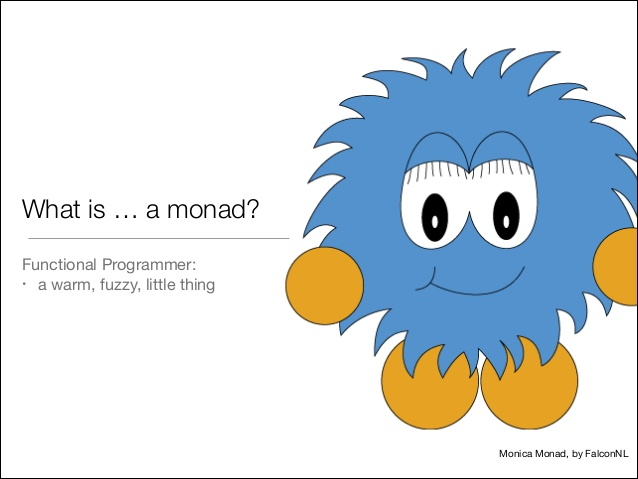
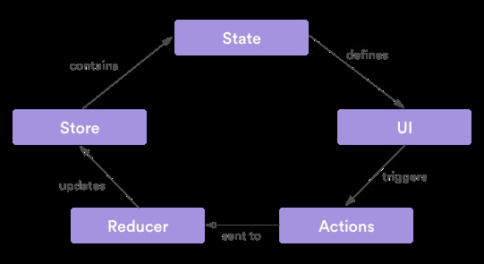

# FP i javascript, part 3️⃣

---

# Part 3?

---

# Ja, part 3!

---
# Ja, part 3!

- Part 1, Grunder
- Part 2, RxJs
- Part 3, Fortsättning med FP i JS och med React (kul att du är här)

---

# Part 3️⃣

---

# Uppmaning till er!

Säg till när:

---

# Uppmaning till er!

Säg till när:

* vill

---

# Uppmaning till er!

Säg till när:

* vill
* seriöst

---

# Pipe

---

# Pipe

```js
function doubleSay(str) {
  return str + ', ' + str
}
function capitalize(str) {
  return str[0].toUpperCase() + str.substring(1)
}
function exclaim(str) {
  return str + '!'
}

const result = exclaim(capitalize(doubleSay('hello')));
result //=> 'Hello, hello!'
```

---

# Pipe

```js
function doubleSay(str) {
  return str + ', ' + str
}
function capitalize(str) {
  return str[0].toUpperCase() + str.substring(1)
}
function exclaim(str) {
  return str + '!'
}

const result = pipe(
  doubleSay,
  capitalize,
  exclaim
)('hello')
result //=> 'Hello, hello!'
```

---

# Pipe

```js
const result = 'hello'
  |> doubleSay
  |> capitalize
  |> exclaim
result //=> 'Hello, hello!'
```

---

# pipe

```js
const pipe = (...ops) => ops.reduce((a, b) => arg => b(a(arg)));
```

---

# compose

---

# compose

> Precis some pipe fast i omvänd ordning

---

# Partial Application och Currying

---

# Partial Application

Skapar en ny funktion som binder argument

---

# Partial Application

```js
add = (a, b) => a + b
add(2, 5) === 7 // true

add2 = a => add(2, a)
add2(5) === 7 // true
```

---

# Partial Application

```js
add = (a, b) => a + b

add2 = add.bind(null, 2)
add2(5) === 7 // true
```

---

# Partial Application

```js
add = (a, b) => a + b

add2and5 = add.bind(null, 2, 5)
add2and5() === 7 // true
```

---

# Currying

```js
add = (a, b, c) => a + b + c

addCurry = a => b => c => a + b + c
addCurry(1)(2)(3) === 6 // true
```

---

# Currying

```js
export const TodoApp = connect(mapStateToProps)(TodoAppView)
```

---

# Currying

```js
const connectAuth = connect(mapAuthToProps)

const TodoApp = connectAuth(TodoAppView)
const SomeOtherComponent = connectAuth(SomeView)
```

---

# Currying

```js
const connectAuth = connect(mapAuthToProps)

const TodoApp = pipe(
  connectAuth,
  defaultProps({ someProp: 'someValue' }),
  pure
)(TodoAppView)
```

---


> undefined is not a function 

---

> Cannot read property 'myProp' of undefined

---

> Cannot read property 'myProp' of null

---

```js
typeof null === "object" // true
```
---


---

- Hur hanterar vi if-statement?
- Hur hanterar vi `null` (och `undefined`) exceptions?

---

# Monad

---


---



---

```js

import { Maybe } from 'ramda-fantasy'

const user = {
  name: 'Oskar'
}

const maybeUser = Maybe(user)
const maybeName = maybeUser.map(user => user.name)

console.log(maybeName.getOrElse('Måns')) // Oskar

```

---

```js

import { Maybe } from 'ramda-fantasy'

const user = null

const maybeUser = Maybe(user)
const maybeName = maybeUser.map(user => user.name)

console.log(maybeName.getOrElse('Måns')) // Måns

```

---


---

```js
const user = {
  name: 'danny',
  email: 'daenerys.targaryen@dragonstone.com',
  meta: {
    languages: {
      primary: 'se',
      secondary: 'en'
    }
  }
};

const languageUrls = {
  en: 'https://somesite.com/en',
  se: 'https://somesite.com/se',
  no: 'https://somesite.com/no'
}

function getPrimaryLanguageUrlForUser(user) {
  if (user === null) {
    return languageUrls['en'];
  }
  if (user.meta && user.meta.languages && user.meta.languages.primary) {
    if (languageUrls[user.meta.languages.primary]) {
      return languageUrls[user.meta.languages.primary];
    } else {
      return languageUrls['en'];
    }
  }
}

```

---

```js
function getPrimaryLanguageUrlForUser(user) {
  if (user === null) {
    return languageUrls['en'];
  }
  if (user.meta && user.meta.languages && user.meta.languages.primary) {
    if (languageUrls[user.meta.languages.primary]) {
      return languageUrls[user.meta.languages.primary];
    } else {
      return languageUrls['en'];
    }
  }
}
```

---

```js
function getPrimaryLanguageUrlForUser(user) {
  if (user === null || user === undefined) {
    return languageUrls['en'];
  }
  if (user.meta && user.meta.languages && user.meta.languages.primary) {
    if (languageUrls[user.meta.languages.primary]) {
      return languageUrls[user.meta.languages.primary];
    } else {
      return languageUrls['en'];
    }
  }
  return languageUrls['en'];
}
```

---

# Maybe fort.

---

```js
document.getElementById('comments').innerHTML = commentDom
```

---

> Uncaught TypeError: Cannot read property 'innerHTML' of null

---

```ts
function maybeGetElem(id: string): Maybe<HTMLElement> {
  return Maybe(document.getElementById(id));
}

maybeGetElem('my-element').map(element => doSomething(element))
```

---

# Either monad

---

> Antingen bra eller dåligt

---

> Antingen rätt eller fel

---

> Antingen Höger eller Vänster

---

> Antingen Moderat eller Vänster

---

```ts
function parseJSON(json) {
  try {
    return Right(JSON.parse(json));
  } catch (e) {
    return Left(e);
  }
}
```

---

```js
parseJSON(someJson).map(data => doSomething(data))
```

---

## Fast det det där kan vi göra med en Maybe också?!

---

```ts
function parseJSON(json) {
  try {
    return Maybe(JSON.parse(json));
  } catch (e) {
    return Maybe.None()
  }
}

parseJSON(someJson).map(data => doSomething(data))
```

---

```js
function parseJSON(json) {
  try {
    return Right(JSON.parse(json));
  } catch (e) {
    return Left(e);
  }
}

parseJSON(someJson)
  .flatMap(data => data.name ? Right(data.name) : Left(new Error('No name')))
  .flatMap(name => name.first ? Right(name.first) : Left(new Error('No first name')))
  .map(firstName => firstName.toUpperCase())
```

---

## Monad, Functor, Foldable, Bifunctor, Applicative, Chain, currying, partial application

---

# Vem bryr sig?

---

# AKA. Jag kommer inte ihåg skillnaden

---

# Labb

---

# Men först, några frågor eller kommentarer så här långt?

---

# Är detta slutet?

---

# Ja 😔 😢

---


---

# Typescript?

---

# Vart var jag?

---

# Just det, labben!

---

# Recompose

---

# Recompose

> A React utility belt for function components and higher-order components

---

```js
function MyHeadlineView() {
  return h3('My Text')
}
```

---

```js
function MyHeadlineView() {
  return h3('My Text')
}

export const MyComponent = compose(
  connect(mapStateToProps, mapDispatchToProps),
  pure,
  ShowLoadingTextIfLoading,
  branch(emptySearchResult, renderComponent(NoResult))
)(MyHeadlineView)
```

---

# Redux

---



---

# labba.nu
