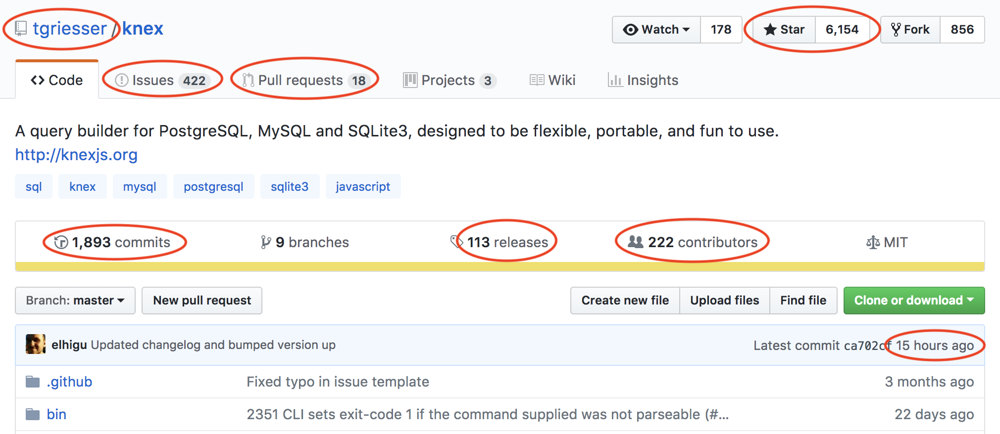

build-lists: true

# JavaScript

---

# Låt oss börja med en enkel övning

---

# Räck upp en hand! ✋

---

# Räck upp en hand om:

- du har hört talas om javascript förut
- du har skrivit minst en rad javascript
- du anser att du kan javascript relativt bra

---

# Vart var jag?

---

# Just det, javascript!

---

> JavaScript är ett prototyp-baserat skriptspråk som är dynamiskt, svagt typat och hanterar funktioner som första-klass-objekt.

---


---


---

## JavaScript är ett prototyp-baserat skriptspråk

```js
const one = 1
one.hello = 'World'

one.hello // 'World'
// Is there an 'hello' property on `one`? Yes, and its value is 'World'.

one.toString() // '1'
// Is there an 'toString' property on `one`? Noop! Check its property!
// Is there an 'toString' property on `one.property`? Yes! It's a function and its return value is '1'.
```

---

```js
const one = 1

one.toString() // '1'

Number.prototype.toString.call(one) // '1'
```

---

### som är dynamiskt, svagt typat

```js
let one = 1
```

---

### som är dynamiskt, svagt typat

```js
let one = 1
one = '1'
```

---

### som är dynamiskt, svagt typat

```js
const myDate = new Date()
myDate.getTime() // 1518166355712
```

---

### som är dynamiskt, svagt typat

```js
const myDate = new Date()
myDate.getTime() // 1518166355712

function myGetTime() {
  return 1000000000000
}

myDate.getTime = myGetTime

myDate.getTime() // 1000000000000
```

---


---


---

## hanterar funktioner som första-klass-objekt

---

## Demo

```js
function hello() {
  return 'world'
}
```

---

# var vs let vs const vs

---

> const > let > var

---

# Modules

---

```js
// circle.js
export function area(r) {
  return Math.PI * r ** 2
}
```

```js
// app.js
import { area } from './circle'

console.log(area(1))
```

---

# This

```js
class Animal {
  constructor(name) {
    this.name = name
  }

  getName() {
    return this.name
  }

  sayHi() {
    return 'Hi!'
  }
}

const animal = new Animal('Måns')
```

---

# Varför jag älskar JavaScript?

---

# Kan skapa allt i javascript

Atwood's Law:

> Any application that can be written in JavaScript, will eventually be written in JavaScript

---

# Kan skapa allt i javascript

- web - frontend kod (typ alla)
- web - backend kod (uber, paypal, LinkedIn, netflix, medium)
- mobil appar (mesenger, instagram, Airbnb)
- detsktop appar (slack, atom, vs code, brave)
- tv appar (apple tv\*, lg, samsung)
- cli (många\*)
- IoT (Kylskåp, Bilar, Mikrovågsugnar)
- Operativsystem (nodeos, jsos)

---


---

> There's an npm module for that

- Steve Jobs

---



---

# Javascript (ECMAScript) versioner

- 1997: ES1 (ECMAScript version 1)
- 1998: ES2
- 1999: ES3
- 2007: ES4 (övergavs)
- 2009: ES5
- 2015: ES2015 (Även kallat ES6)
- 2016: ES2016
- 2017: ES2017
- 2018: ES2018

---

```js
const add = (a, b) => a + b
const a = 1
const b = 2
const result = add(a, b)
```

---

# Transpilers

- Babel
- Typescript

---

```js
const add = (a, b) => a + b
const a = 1
const b = 2
const result = add(a, b)

// konverteras med babel/typescript till:

var add = function add(a, b) {
  return a + b
}
var a = 1
var b = 2
var result = add(a, b)
```

---

```ts
function add(a: number, b: number): number {
  return a + b
}

add(1, '2') // Error: argument of type '2' is assignable to parameter of type 'number'
```

---

# Frågor så här långt?

---

> Jag har en fråga!

---

> Ska man använda semicolon?

---

```js
[] + [] // ?
[] + {} // ?
```

---

https://www.destroyallsoftware.com/talks/wat

---


