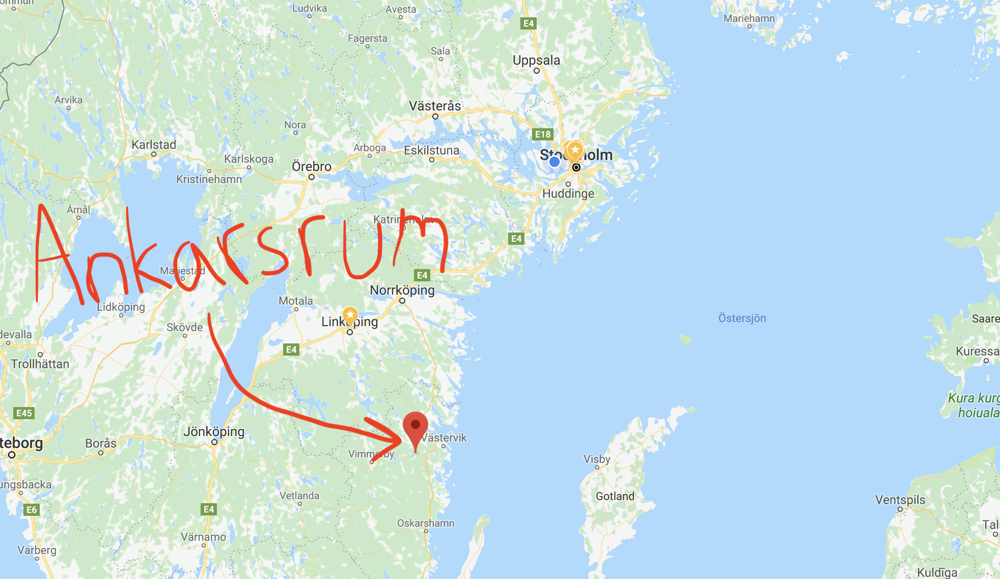
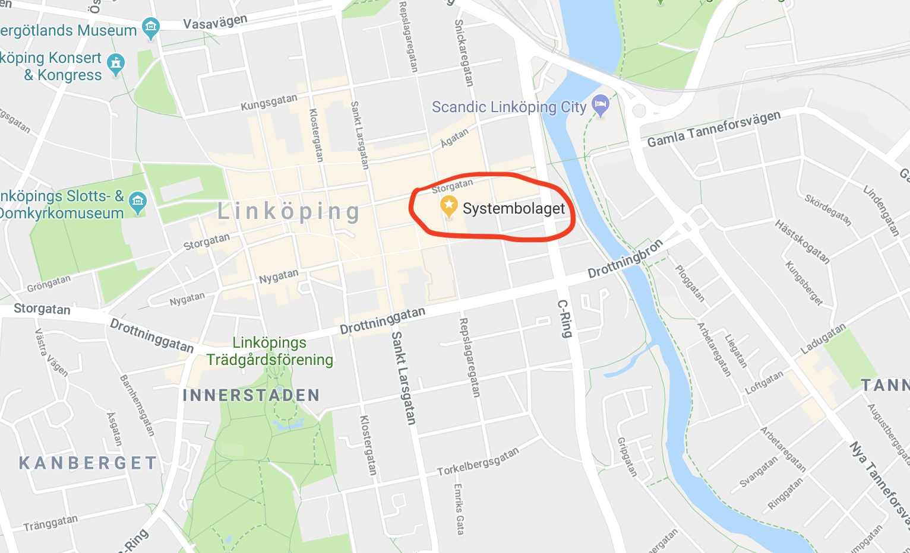

---

## Vad ska jag snacka om?

---

## Snacka om vad du vill!

---

## Vad jag vill?

---

## Jepp, vad du vill!

---

---

---

---

1. Mig själv

---

1. Mig själv
2. JavaScript

---

### nej, jag har inte hybris

---

### Eller?

---

---

### Vem är jag?

---

# Oskar Karlsson

---

---

---

---

---

---

---

---

### Låt oss backa bandet lite

---

^ När jag läste min master, jobba jag extra som utvecklare och drev ett bolag till sammans med en kompis som utvecklare

---

> ... men jag programerar aldrig på fritiden

---

> ... jag umgås med vänner

---

> ... jag ligger i soffan och kollar på Netflix

---

> ... måste jag börja programmera på fritiden?

---

# NEJ!

---

### Vi behöver alla typer av människor

---

### Programmering är som en drog för mig

---

> Jag kan sluta när jag vill

---

> Jag kan sluta när jag vill
– Alla som är beroende av en drog

---

^ Hur kan jag spendera mer tid som jag inte har?
Låt mig starta ett hobbyprojekt.
Jag började med ett hobby projekt som var tänkt till mig och mina vänner
Jag började då koda i PHP
Man kan tycka vad man vill om PHP
PHP har fått för mycket skit 
Viss kritik är befogad men det finns alltid en anledning till att man valt ett viss språk
Jag valde PHP för att det var lätt att komma igång med
Enkelt att hitta svar på stack overflow

---

Lärdom 1: Det finns alltid* en anledning till alla designval

^ Man kan tycka vad man vill om ex. PHP men säg alldig att det är skit.
Facebook hade alldrig kunnat växa så snabbt som de hade gjort om de valde något annat språk
PHP är lätt att lära sig och lätt att anställa PHP utvecklar

---

^ Mitt hobbyprojekt, jag skrev alltså projektet i PHP. Jag skrev i hopp det på ca en vecka. Mitt mål var ca 5 användare. Jag har nu ca 15000 användare

---

Lärdom 2: Inget system som är skrivet för fem användaren fungerar för 15000 användare

---

^ Jag började därför skriva om projektet till microkänster i nodejs
När jag gick över till nodejs så öppnades en helt ny värld upp för mig och jag började inse hur vantastisk open source välden är
Så jag började hjälpa folk med deras open source projekt och fixa buggar som jag upptäckte och detta var otroligt lärorikt
Några projekt som jag har hjälpt till med är Typescript som är ett programmeringspråk, Brackets som är en IDE, Angular som är ett ramverk, rx som är ett lib och en massa andra

---

Lärdom 3: Engagera dig i open soure. Otroligt lärorikt.

---

^ När en idål kommenterar eller godkänner en PR

---

# 🤓

---

^ När jag började med mitt hobbyprojekt för fem år sedan så tänkte jag att det skulle ta totalt ca 2 veckor

---

### Fem år senare

---

### Det är inte klart

---

Lärdom 4: Inget mjukvarusystem som används kommer bli klart

---

> Ett system som är klart är ett system som inte används
- Oskar

---

<!--
##### Lärdom 5:

- Testa er kod!

---

##### Lärdom 5:

- Testa er kod!
- Logga vad användaren gör!

---

##### Lärdom 5:

- Testa er kod!
- Logga vad användaren gör!
- Stackoverflow har alla svar!

---

-->

Lärdom 6: Ingen utvecklare vet vad de sysslar med!

^ Om ni ska ta med er något från denna presentation så är det just detta! 
Dessto snabbare ni kommer underfull med detta desto bättre!
Vi (utvecklare) har skapat en myt om oss själva om att vi är super smarta
Men vi googlar ju hela dagarna, det är det vi gör

---

Lärdom 7: Jobba inte förmycket

---

> Jag skulle ha jobbat mer
- Ingen på sin dödsbädd

^ När ni ligger er dödsbädd så kommer ingen säga Jag skulle ha jobbat mer!
INGEN kommer säga så, tvärt om. Jag tror att de flesta kommer tänka, jag skulle ha spänderat mer tid med mina vänner och familj
Vilken arbetsgivare ni än väljer när ni tar examen, arbeta inte förmycket!
Valtech förespråkar inte övertid, andra arbetsplatser tror på arbetstid, valtech gör det inte
Det som har med jobbet att göra ska vara på arbetstid. 
Gör även annan research! Små saker som en egen lapptop av ert val. Det är en så låg kostnad men ingen självklarhet

---

# Frågor så här långt?

---

# Låt oss snacka JavaScript!

---

^ Man kan tycka vad man vill om javascript men det är det bästa vi har
Det viss javascripts motorer överallt!
Låt oss göra en quiz!

---

